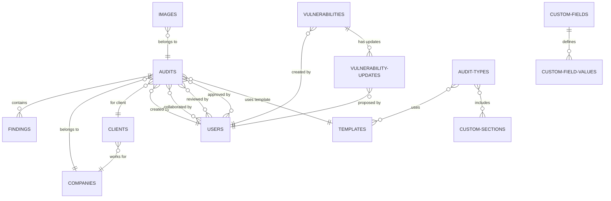

# Database Schema Documentation

This document provides a comprehensive overview of the MongoDB database schema for pwndoc-ng, including all collections, relationships, and data structures.

## Table of Contents

1. [Overview](#overview)
2. [Collections Overview](#collections-overview)
3. [Core Collections](#core-collections)
4. [Reference Data Collections](#reference-data-collections)
5. [System Collections](#system-collections)
6. [Relationships Diagram](#relationships-diagram)
7. [Indexes](#indexes)
8. [Data Validation](#data-validation)
9. [Migration Guidelines](#migration-guidelines)

---

## Overview

The pwndoc-ng database uses MongoDB as its primary data store, leveraging a document-based schema that supports complex nested structures and flexible data models. The schema is designed to handle cybersecurity audit workflows with emphasis on:

- **Flexible Document Structure**: Support for custom fields and dynamic content
- **Referential Integrity**: ObjectId references between related collections
- **Audit Trail**: Timestamped documents for tracking changes
- **Multi-language Support**: Locale-based content organization
- **Security**: Role-based access control and data validation

---

## Collections Overview

The database consists of 14 primary collections organized into three categories:

### **Core Business Collections**
- `audits` - Main audit documents and findings
- `vulnerabilities` - Vulnerability database
- `vulnerability-updates` - Vulnerability update tracking
- `users` - User accounts and authentication
- `companies` - Client company information
- `clients` - Client contact information

### **Reference Data Collections**
- `languages` - Supported languages
- `audit-types` - Audit type definitions
- `vulnerability-types` - Vulnerability classifications
- `vulnerability-categories` - Vulnerability categorization
- `custom-fields` - Dynamic field definitions
- `custom-sections` - Custom report sections

### **System Collections**
- `templates` - Report templates
- `images` - Image storage metadata
- `settings` - Application configuration

---

## Core Collections

### **Audits Collection**

**Purpose**: Central collection containing all audit information, findings, and metadata.

```javascript
{
  _id: ObjectId,
  name: String,                    // Audit name (required)
  auditType: String,              // Reference to audit type
  date: String,                   // Audit date
  date_start: String,             // Start date
  date_end: String,               // End date
  summary: String,                // Executive summary
  company: ObjectId,              // → companies._id
  client: ObjectId,               // → clients._id
  collaborators: [ObjectId],      // → users._id (multiple)
  reviewers: [ObjectId],          // → users._id (multiple)
  language: String,               // Audit language (required)
  scope: [{                       // Audit scope definition
    _id: false,
    name: String,                 // Scope name
    hosts: [{                     // Host information
      hostname: String,
      ip: String,
      os: String,
      services: [{               // Service details
        port: Number,
        protocol: String,         // 'tcp' | 'udp'
        name: String,
        product: String,
        version: String
      }]
    }]
  }],
  findings: [{                    // Security findings
    id: ObjectId,
    identifier: Number,           // Sequential number for report
    title: String,
    vulnType: String,
    description: String,
    observation: String,
    remediation: String,
    remediationComplexity: Number, // 1-3 scale
    priority: Number,             // 1-4 scale
    references: [String],         // External references
    cvssv3: String,              // CVSS vector string
    paragraphs: [{               // Rich content
      text: String,
      images: [{
        image: String,
        caption: String
      }]
    }],
    poc: String,                 // Proof of concept
    scope: String,               // Finding scope
    status: Number,              // 0: done, 1: redacting
    category: String,
    customFields: [{             // Dynamic custom fields
      _id: false,
      customField: ObjectId,     // → custom-fields._id
      text: Mixed                // Field value
    }]
  }],
  template: ObjectId,            // → templates._id
  creator: ObjectId,             // → users._id
  sections: [{                   // Custom report sections
    field: String,
    name: String,
    text: String,                // Legacy field
    customFields: [{             // Custom field values
      _id: false,
      customField: ObjectId,     // → custom-fields._id
      text: Mixed
    }]
  }],
  customFields: [{               // Audit-level custom fields
    _id: false,
    customField: ObjectId,       // → custom-fields._id
    text: Mixed
  }],
  sortFindings: [{               // Finding sort configuration
    _id: false,
    category: String,
    sortValue: String,
    sortOrder: String,           // 'desc' | 'asc'
    sortAuto: Boolean
  }],
  state: String,                 // 'EDIT' | 'REVIEW' | 'APPROVED'
  approvals: [ObjectId],         // → users._id (approvers)
  createdAt: Date,               // Auto-generated
  updatedAt: Date                // Auto-generated
}
```

### **Users Collection**

**Purpose**: User account management with authentication and authorization.

```javascript
{
  _id: ObjectId,
  username: String,              // Unique username (required)
  password: String,              // Bcrypt hashed password (required)
  firstname: String,             // First name (required)
  lastname: String,              // Last name (required)
  email: String,                 // Email address (optional)
  phone: String,                 // Phone number (optional)
  role: String,                  // User role (default: 'user')
  totpEnabled: Boolean,          // 2FA enabled flag (default: false)
  totpSecret: String,            // TOTP secret for 2FA
  enabled: Boolean,              // Account enabled flag (default: true)
  refreshTokens: [{              // Active refresh tokens
    _id: false,
    sessionId: String,
    userAgent: String,
    token: String
  }],
  createdAt: Date,
  updatedAt: Date
}
```

### **Vulnerabilities Collection**

**Purpose**: Master vulnerability database with multi-language support.

```javascript
{
  _id: ObjectId,
  cvssv3: String,                // CVSS v3 vector string
  priority: Number,              // 1-4 priority scale
  remediationComplexity: Number, // 1-3 complexity scale
  details: [{                    // Multi-language details
    _id: false,
    locale: String,              // Language code
    title: String,               // Unique per locale
    vulnType: String,
    description: String,
    observation: String,
    remediation: String,
    references: [String],
    customFields: [{
      _id: false,
      customField: ObjectId,     // → custom-fields._id
      text: Mixed
    }]
  }],
  status: Number,                // 0: validated, 1: created, 2: updated
  category: String,
  creator: ObjectId,             // → users._id
  updatedAt: String,             // Custom timestamp
  createdAt: Date,
  updatedAt: Date
}
```

### **Companies Collection**

**Purpose**: Client company information and branding.

```javascript
{
  _id: ObjectId,
  name: String,                  // Company name (required, unique)
  shortName: String,             // Abbreviated name
  logo: String,                  // Logo image reference
  createdAt: Date,
  updatedAt: Date
}
```

### **Clients Collection**

**Purpose**: Client contact information linked to companies.

```javascript
{
  _id: ObjectId,
  email: String,                 // Email address (required, unique)
  company: ObjectId,             // → companies._id
  lastname: String,
  firstname: String,
  phone: String,
  cell: String,                  // Mobile phone
  title: String,                 // Job title
  createdAt: Date,
  updatedAt: Date
}
```

---

## Reference Data Collections

### **Custom Fields Collection**

**Purpose**: Dynamic field definitions for extensible forms.

```javascript
{
  _id: ObjectId,
  fieldType: String,             // Field type (text, input, select, etc.)
  label: String,                 // Field label
  display: String,               // Display context
  displaySub: String,            // Sub-display context
  position: Number,              // Display order
  size: Number,                  // Grid size (1-12)
  offset: Number,                // Grid offset (0-12)
  required: Boolean,             // Required field flag
  description: String,           // Help text
  text: [{                       // Multi-language text
    _id: false,
    locale: String,
    value: Mixed
  }],
  options: [{                    // Select/radio options
    _id: false,
    locale: String,
    value: String
  }],
  createdAt: Date,
  updatedAt: Date
}
```

### **Languages Collection**

**Purpose**: Supported language definitions.

```javascript
{
  _id: ObjectId,
  language: String,              // Language name (unique)
  locale: String,                // Locale code (unique)
  createdAt: Date,
  updatedAt: Date
}
```

### **Audit Types Collection**

**Purpose**: Audit type definitions with associated templates and sections.

```javascript
{
  _id: ObjectId,
  name: String,                  // Audit type name (unique)
  templates: [{                  // Associated templates
    _id: false,
    template: ObjectId,          // → templates._id
    locale: String               // Language specific template
  }],
  sections: [String],            // → custom-sections.field
  hidden: [String],              // Hidden sections: 'network' | 'findings'
  createdAt: Date,
  updatedAt: Date
}
```

### **Vulnerability Types Collection**

**Purpose**: Vulnerability type classifications by language.

```javascript
{
  _id: ObjectId,
  name: String,                  // Type name
  locale: String,                // Language code
  createdAt: Date,
  updatedAt: Date
}
```

### **Vulnerability Categories Collection**

**Purpose**: Vulnerability categorization system.

```javascript
{
  _id: ObjectId,
  name: String,                  // Category name
  locale: String,                // Language code
  createdAt: Date,
  updatedAt: Date
}
```

### **Custom Sections Collection**

**Purpose**: Custom report section definitions.

```javascript
{
  _id: ObjectId,
  field: String,                 // Field identifier (required, unique)
  name: String,                  // Display name (required, unique)
  icon: String,                  // Icon class name
  createdAt: Date,
  updatedAt: Date
}
```

---

## System Collections

### **Templates Collection**

**Purpose**: Report template metadata.

```javascript
{
  _id: ObjectId,
  name: String,                  // Template name (required, unique)
  ext: String,                   // File extension (required)
  createdAt: Date,
  updatedAt: Date
}
```

### **Images Collection**

**Purpose**: Image storage metadata and references.

```javascript
{
  _id: ObjectId,
  auditId: ObjectId,             // → audits._id (optional)
  value: String,                 // Image identifier (required, unique)
  name: String,                  // Original filename
  createdAt: Date,
  updatedAt: Date
}
```

### **Settings Collection**

**Purpose**: Application-wide configuration settings.

```javascript
{
  _id: ObjectId,
  report: {
    enabled: Boolean,            // Report generation enabled
    public: {
      cvssColors: {              // CVSS severity colors
        noneColor: String,       // Hex color
        lowColor: String,
        mediumColor: String,
        highColor: String,
        criticalColor: String
      },
      remediationColorsComplexity: {
        lowColor: String,
        mediumColor: String,
        highColor: String
      },
      remediationColorsPriority: {
        lowColor: String,
        mediumColor: String,
        highColor: String,
        urgentColor: String
      },
      captions: [String],        // Available caption types
      extendCvssTemporalEnvironment: Boolean
    },
    private: {
      imageBorder: Boolean,
      imageBorderColor: String
    }
  },
  reviews: {
    enabled: Boolean,            // Review workflow enabled
    public: {
      mandatoryReview: Boolean,
      minReviewers: Number       // 1-100
    },
    private: {
      removeApprovalsUponUpdate: Boolean
    }
  },
  danger: {
    enabled: Boolean,            // Danger zone features
    public: {
      nbdaydelete: Number        // Days before deletion (1-365)
    },
    private: {}
  }
}
```

### **Vulnerability Updates Collection**

**Purpose**: Track proposed changes to vulnerabilities.

```javascript
{
  _id: ObjectId,
  vulnerability: ObjectId,       // → vulnerabilities._id (required)
  creator: ObjectId,             // → users._id (required)
  cvssv3: String,
  priority: Number,              // 1-4
  remediationComplexity: Number, // 1-3
  references: [String],
  locale: String,
  title: String,
  vulnType: String,
  description: String,
  observation: String,
  remediation: String,
  category: String,
  customFields: [{
    _id: false,
    customField: ObjectId,       // → custom-fields._id
    text: Mixed
  }],
  createdAt: Date,
  updatedAt: Date
}
```

---

## Relationships Diagram



---

## Indexes

### **Primary Indexes**

#### Users Collection
```javascript
// Unique username for authentication
{ "username": 1 } // unique: true

// Optional email lookup
{ "email": 1 } // sparse: true
```

#### Audits Collection
```javascript
// Creator lookups
{ "creator": 1 }

// Collaborator queries
{ "collaborators": 1 }

// State filtering
{ "state": 1 }

// Recent audits
{ "createdAt": -1 }

// Finding searches
{ "findings.title": "text" }
```

#### Vulnerabilities Collection
```javascript
// Title searches within locale
{ "details.title": 1 }

// Category filtering
{ "category": 1 }

// Creator lookups
{ "creator": 1 }
```

#### Companies Collection
```javascript
// Unique company names
{ "name": 1 } // unique: true
```

#### Clients Collection
```javascript
// Unique email addresses
{ "email": 1 } // unique: true

// Company association
{ "company": 1 }
```

### **Composite Indexes**

#### Custom Fields Collection
```javascript
// Ensure unique label-display combinations
{
  "label": 1, 
  "display": 1, 
  "displaySub": 1
} // unique: true, partial filter
```

#### Vulnerability Types Collection
```javascript
// Unique name per locale
{ "name": 1, "locale": 1 } // unique: true
```

#### Languages Collection
```javascript
// Unique language names and locales
{ "language": 1 } // unique: true
{ "locale": 1 } // unique: true
```

---

## Data Validation

### **Schema Validation Rules**

#### Enumerations
```javascript
// User roles
role: ['user', 'admin', 'reviewer', 'auditor']

// Audit states
state: ['EDIT', 'REVIEW', 'APPROVED']

// Priority levels
priority: [1, 2, 3, 4] // 1=Low, 2=Medium, 3=High, 4=Urgent

// Complexity levels
remediationComplexity: [1, 2, 3] // 1=Low, 2=Medium, 3=High

// Vulnerability status
status: [0, 1, 2] // 0=Validated, 1=Created, 2=Updated

// Network protocols
protocol: ['tcp', 'udp']

// Finding status
status: [0, 1] // 0=Done, 1=Redacting

// Sort orders
sortOrder: ['desc', 'asc']
```

#### Format Validation
```javascript
// Color validation (hex colors)
const colorValidator = (v) => /^#([0-9a-f]{3}){1,2}$/i.test(v);

// Email validation (built-in Mongoose validator)
email: { type: String, validate: [validator.isEmail, 'Invalid email'] }

// CVSS vector validation
cvssv3: { type: String, validate: [cvssValidator, 'Invalid CVSS vector'] }
```

#### Required Field Validation
```javascript
// Critical required fields
{
  'audits.name': { required: true },
  'audits.language': { required: true },
  'users.username': { required: true, unique: true },
  'users.password': { required: true },
  'users.firstname': { required: true },
  'users.lastname': { required: true },
  'companies.name': { required: true, unique: true },
  'clients.email': { required: true, unique: true }
}
```

### **Business Logic Validation**

#### Password Policy
```javascript
// Enforced in application layer
const passwordPolicy = {
  minLength: 8,
  requireUppercase: true,
  requireLowercase: true,
  requireNumbers: true,
  requireSpecialChars: true
};
```

#### TOTP Validation
```javascript
// Two-factor authentication
const totpValidation = {
  algorithm: 'SHA1',
  digits: 6,
  period: 30,
  window: 5 // ±2 time windows
};
```

---

## Migration Guidelines

### **Schema Evolution Patterns**

#### Adding New Fields
```javascript
// Always provide default values
newField: { type: String, default: '' }

// Use schema versioning for major changes
schemaVersion: { type: Number, default: 1 }
```

#### Field Removal
```javascript
// Mark as deprecated first
deprecatedField: { type: String, deprecated: true }

// Remove in subsequent version
// Document removal in migration scripts
```

#### Data Type Changes
```javascript
// Create new field alongside old field
oldField: String,           // Keep for migration
newField: ObjectId,         // New type

// Migrate data in application layer
// Remove old field after verification
```

### **Index Management**

#### Creating Indexes
```javascript
// Background index creation for production
db.collection.createIndex(
  { "field": 1 }, 
  { background: true }
);
```

#### Index Monitoring
```javascript
// Monitor index usage
db.collection.aggregate([
  { $indexStats: {} }
]);

// Remove unused indexes
db.collection.dropIndex("indexName");
```

### **Data Consistency**

#### Referential Integrity
```javascript
// Use populate to maintain relationships
const auditWithRefs = await Audit.findById(id)
  .populate('creator')
  .populate('company')
  .populate('collaborators');
```

#### Cleanup Procedures
```javascript
// Remove orphaned documents
const orphanedImages = await Image.find({
  auditId: { $nin: await Audit.distinct('_id') }
});
```

This database schema documentation serves as the definitive reference for understanding the data structure and relationships within pwndoc-ng. Regular updates ensure accuracy as the schema evolves. 