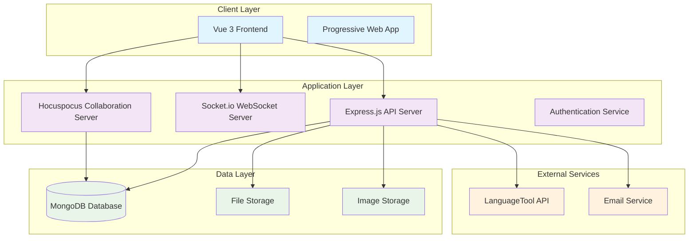
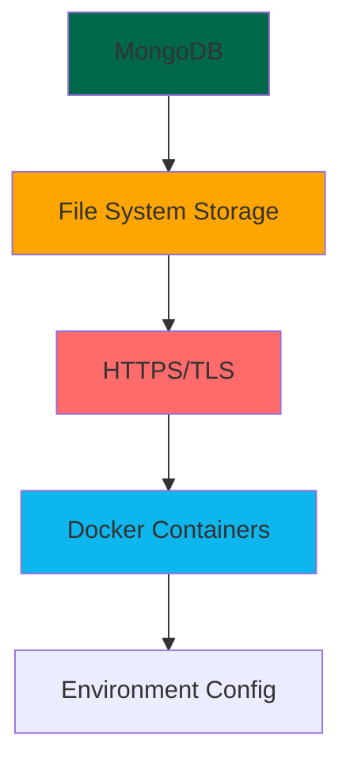
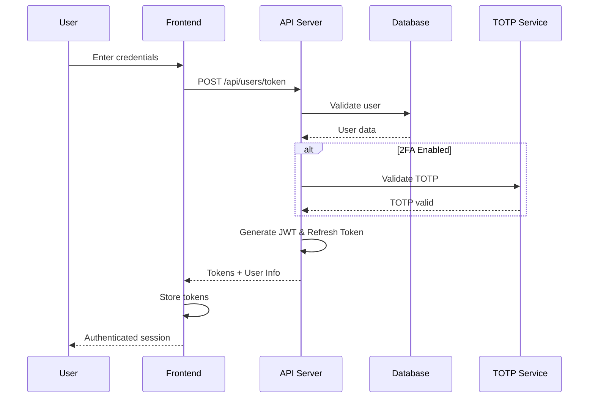
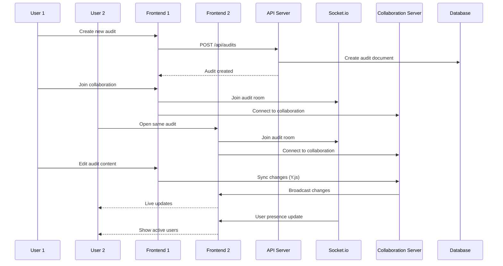
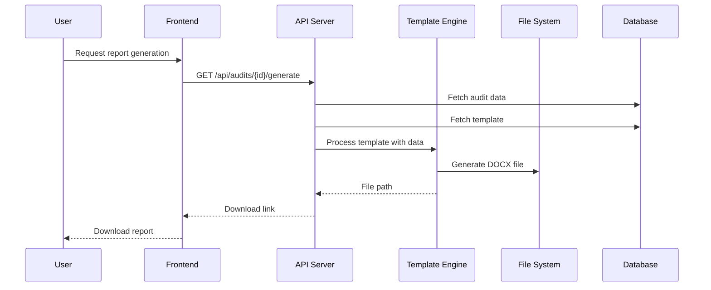
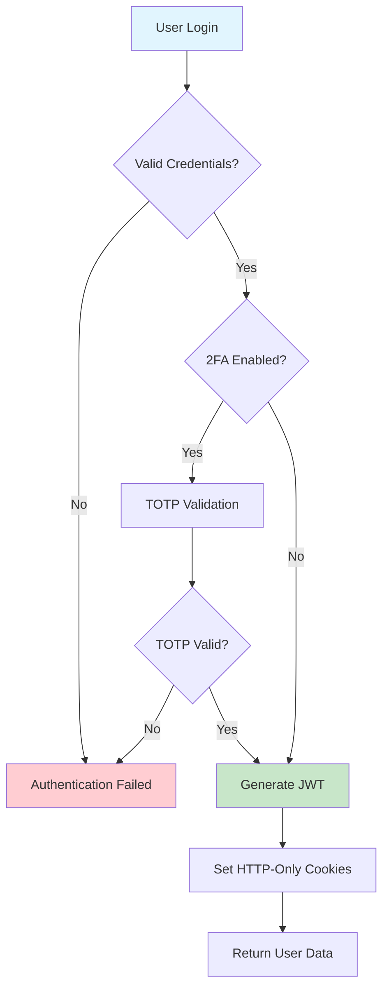
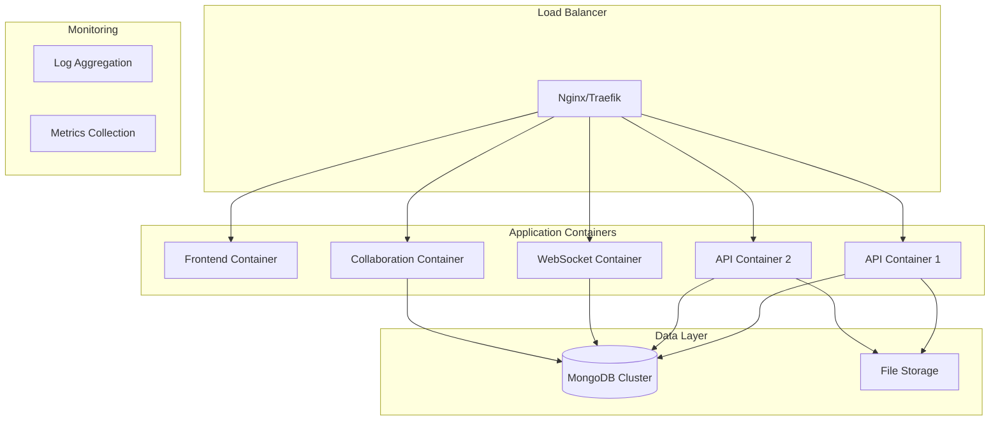

# System Architecture Overview

This document provides a comprehensive overview of the pwndoc-ng system architecture, explaining how all components work together to provide a complete cybersecurity audit management platform.

## Table of Contents

1. [Architecture Overview](#architecture-overview)
2. [System Components](#system-components)
3. [Technology Stack](#technology-stack)
4. [Data Flow](#data-flow)
5. [Communication Patterns](#communication-patterns)
6. [Security Architecture](#security-architecture)
7. [Deployment Architecture](#deployment-architecture)
8. [Scalability Considerations](#scalability-considerations)
9. [Integration Points](#integration-points)

---

## Architecture Overview

pwndoc-ng follows a modern **three-tier architecture** with a clear separation of concerns between presentation, business logic, and data layers. The system is designed as a **Single Page Application (SPA)** with a **RESTful API backend** and **real-time collaboration** features.

### **High-Level Architecture Diagram**



### **Architecture Principles**

- **Separation of Concerns**: Clear boundaries between UI, business logic, and data
- **Microservice-Ready**: Modular design allowing for future service decomposition
- **Event-Driven**: Real-time updates using WebSocket communication
- **Stateless API**: RESTful design with JWT-based authentication
- **Data Consistency**: ACID properties maintained through MongoDB transactions
- **Scalability**: Horizontal scaling capabilities built into the design

---

## System Components

### **Frontend Application (Vue 3 + Quasar)**

**Purpose**: User interface and user experience layer providing audit management capabilities.

**Key Responsibilities**:
- User authentication and session management
- Audit creation, editing, and collaboration
- Vulnerability database management
- Report generation and export
- Real-time collaboration interfaces
- Responsive design for multiple devices

**Technologies**:
- **Vue 3**: Progressive JavaScript framework with Composition API
- **Quasar Framework**: Material Design component library
- **TipTap**: Rich text editing with collaborative features
- **Socket.io Client**: Real-time WebSocket communication
- **Axios**: HTTP client for API communication
- **Vue Router**: Client-side routing
- **Vue i18n**: Internationalization support

### **Backend API Server (Node.js + Express)**

**Purpose**: Core business logic, data processing, and API endpoint management.

**Key Responsibilities**:
- RESTful API endpoints for all business operations
- User authentication and authorization (JWT + RBAC)
- Data validation and business rule enforcement
- Report generation and document processing
- Integration with external services
- Security and access control

**Technologies**:
- **Node.js**: JavaScript runtime environment
- **Express.js**: Web application framework
- **Mongoose**: MongoDB object modeling
- **JWT**: Token-based authentication
- **bcrypt**: Password hashing
- **Docxtemplater**: DOCX report generation

### **Real-time Communication Layer**

**Purpose**: Enable real-time collaboration and live updates across client sessions.

**Components**:

#### **Socket.io Server**
- User presence tracking
- Audit room management
- Real-time notifications
- Live user activity updates

#### **Hocuspocus Collaboration Server**
- Y.js CRDT-based document collaboration
- Conflict-free concurrent editing
- Authenticated collaborative sessions
- Real-time document synchronization

### **Database Layer (MongoDB)**

**Purpose**: Persistent data storage with document-based flexibility.

**Key Collections**:
- **Audits**: Main business entities with embedded findings
- **Users**: Authentication and user management
- **Vulnerabilities**: Centralized vulnerability database
- **Companies/Clients**: Customer relationship management
- **Templates**: Report templates and customization
- **Settings**: Application configuration

**Design Patterns**:
- **Embedded Documents**: Findings within audits for performance
- **References**: User relationships and foreign keys
- **Indexes**: Optimized queries for common access patterns
- **Validation**: Schema-level and application-level constraints

---

## Technology Stack

### **Frontend Stack**

```mermaid
graph TD
    A[Vue 3] --> B[Quasar Framework]
    B --> C[TipTap Editor]
    C --> D[Socket.io Client]
    D --> E[Axios HTTP Client]
    E --> F[Vue Router]
    F --> G[Vue i18n]
    
    style A fill:#4FC08D
    style B fill:#00B4FF
    style C fill:#000000
    style D fill:#25c2a0
```



### **Backend Stack**

```mermaid
graph TD
    A[Node.js] --> B[Express.js]
    B --> C[Mongoose ODM]
    C --> D[JWT Authentication]
    D --> E[Socket.io Server]
    E --> F[Hocuspocus Server]
    F --> G[Docxtemplater]
    
    style A fill:#68217A
    style B fill:#000000
    style C fill:#880000
    style D fill:#000000
```



### **Database & Infrastructure**



---

## Data Flow

### **User Authentication Flow**



### **Audit Creation and Collaboration Flow**



### **Report Generation Flow**



---

## Communication Patterns

### **REST API Communication**

**Pattern**: Request-Response over HTTPS
**Usage**: All CRUD operations, authentication, report generation
**Format**: JSON payloads with standardized response structure

```javascript
// Standard API Response Format
{
  "status": "success" | "error",
  "datas": any, // Response payload or error message
  "meta": {     // Optional metadata
    "pagination": {...},
    "timestamps": {...}
  }
}
```

### **WebSocket Communication (Socket.io)**

**Pattern**: Bidirectional event-based communication
**Usage**: Real-time updates, user presence, notifications

```javascript
// Socket.io Event Patterns
socket.emit('join', { room: auditId, username: user.username });
socket.on('updateUsers', () => { /* Handle user list update */ });
socket.on('roomUsers', (users) => { /* Update UI with active users */ });
```

### **Collaborative Editing (Hocuspocus + Y.js)**

**Pattern**: Conflict-free Replicated Data Types (CRDTs)
**Usage**: Real-time document collaboration

```javascript
// Y.js Document Collaboration
const ydoc = new Y.Doc();
const provider = new HocuspocusProvider({
  url: 'wss://server/collab/',
  name: auditId,
  document: ydoc
});
```

---

## Security Architecture

### **Authentication & Authorization**



### **Security Layers**

#### **Transport Security**
- **HTTPS/TLS**: All communications encrypted in transit
- **WebSocket Security**: WSS (WebSocket Secure) for real-time connections
- **HTTP Headers**: Security headers (HSTS, CSP, X-Frame-Options)

#### **Authentication Security**
- **JWT Tokens**: Stateless authentication with 15-minute expiry
- **Refresh Tokens**: Secure token renewal mechanism
- **Password Hashing**: bcrypt with salt rounds
- **2FA Support**: TOTP-based two-factor authentication

#### **Authorization Security**
- **Role-Based Access Control (RBAC)**: Granular permission system
- **Resource-Level Permissions**: Access control per audit/resource
- **API Endpoint Protection**: Every endpoint requires appropriate permissions

#### **Data Security**
- **Input Validation**: Server-side validation of all inputs
- **XSS Prevention**: Content sanitization and CSP headers
- **SQL Injection Protection**: Mongoose ODM parameter binding
- **File Upload Security**: Type validation and size limits

### **Permission Matrix**

| Resource | Admin | User | Reviewer |
|----------|-------|------|----------|
| Create Audits | ✅ | ✅ | ❌ |
| Edit Own Audits | ✅ | ✅ | ❌ |
| Edit All Audits | ✅ | ❌ | ❌ |
| Review Audits | ✅ | ❌ | ✅ |
| Approve Audits | ✅ | ❌ | ✅ |
| Manage Users | ✅ | ❌ | ❌ |
| System Settings | ✅ | ❌ | ❌ |

---

## Deployment Architecture

### **Container-Based Deployment**



### **Environment Configuration**

#### **Development Environment**
```yaml
services:
  frontend:
    image: pwndoc-ng-frontend:dev
    ports: ["3000:3000"]
    environment:
      - NODE_ENV=development
      
  backend:
    image: pwndoc-ng-backend:dev
    ports: ["5252:5252"]
    environment:
      - NODE_ENV=development
      
  mongo:
    image: mongo:6.0
    ports: ["27017:27017"]
```

#### **Production Environment**
```yaml
services:
  frontend:
    image: pwndoc-ng-frontend:latest
    deploy:
      replicas: 2
      
  backend:
    image: pwndoc-ng-backend:latest
    deploy:
      replicas: 3
      
  mongo:
    image: mongo:6.0
    deploy:
      replicas: 3 # Replica set
```

---

## Scalability Considerations

### **Horizontal Scaling Patterns**

#### **Frontend Scaling**
- **CDN Distribution**: Static assets served via CDN
- **Multiple Instances**: Load-balanced frontend containers
- **Cache Strategies**: Browser caching and service workers

#### **Backend Scaling**
- **Stateless Design**: No server-side session state
- **Load Balancing**: Multiple API server instances
- **Database Connection Pooling**: Efficient connection management

#### **Database Scaling**
- **Replica Sets**: Read replicas for query scaling
- **Sharding**: Horizontal partitioning for large datasets
- **Indexing**: Optimized queries for performance

### **Performance Optimization**

#### **Frontend Optimization**
```javascript
// Code splitting for route-based chunks
const AuditEdit = () => import('./pages/audits/edit/index.vue');

// Component lazy loading
const LazyComponent = defineAsyncComponent(() => import('./HeavyComponent.vue'));

// API response caching
const cachedResponse = await $axios.get('/api/data', {
  adapter: cacheAdapterEnhancer($axios.defaults.adapter, {
    maxAge: 1000 * 60 * 5 // 5 minutes
  })
});
```

#### **Backend Optimization**
```javascript
// Database query optimization
const audits = await Audit.find({ creator: userId })
  .select('name state createdAt') // Only required fields
  .populate('creator', 'username') // Specific population
  .lean() // Plain objects instead of Mongoose documents
  .limit(25); // Pagination

// Response compression
app.use(compression());

// Connection pooling
mongoose.connect(uri, {
  maxPoolSize: 10,
  serverSelectionTimeoutMS: 5000,
  socketTimeoutMS: 45000
});
```

---

## Integration Points

### **External Service Integrations**

#### **LanguageTool Integration**
```javascript
// Grammar checking service
const response = await axios.post('https://api.languagetool.org/v2/check', {
  text: content,
  language: 'auto',
  enabledOnly: false
});
```

#### **Email Service Integration**
```javascript
// SMTP configuration for notifications
const transporter = nodemailer.createTransporter({
  host: process.env.SMTP_HOST,
  port: process.env.SMTP_PORT,
  secure: true,
  auth: {
    user: process.env.SMTP_USER,
    pass: process.env.SMTP_PASS
  }
});
```

### **API Integration Patterns**

#### **Webhook Support**
```javascript
// Extensible webhook system for external integrations
app.post('/api/webhooks/:type', async (req, res) => {
  const { type } = req.params;
  const payload = req.body;
  
  await WebhookService.process(type, payload);
  res.status(200).json({ status: 'processed' });
});
```

#### **Plugin Architecture**
```javascript
// Modular plugin system for extending functionality
class PluginManager {
  static registerPlugin(name, plugin) {
    this.plugins.set(name, plugin);
  }
  
  static async executeHook(hookName, context) {
    for (const plugin of this.plugins.values()) {
      if (plugin.hooks?.[hookName]) {
        await plugin.hooks[hookName](context);
      }
    }
  }
}
```

### **Future Integration Considerations**

#### **Microservices Evolution**
- **Service Decomposition**: Breaking monolith into focused services
- **API Gateway**: Centralized routing and authentication
- **Event Sourcing**: Event-driven architecture patterns
- **Message Queues**: Asynchronous processing capabilities

#### **Cloud-Native Features**
- **Kubernetes Deployment**: Container orchestration
- **Service Mesh**: Advanced networking and observability
- **Auto-scaling**: Dynamic resource allocation
- **Multi-region Deployment**: Global availability

This system architecture overview provides the foundation for understanding how pwndoc-ng components work together to deliver a complete cybersecurity audit management platform. The architecture is designed for scalability, maintainability, and extensibility to support future growth and feature additions. 